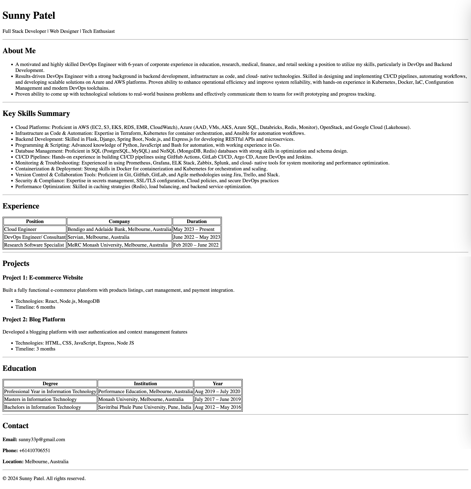

# Single-Page Resume Website (HTML Only)
This is ChaiCode Web Dev Cohort 2026 Assignment which was to be done only on HTML and show case HTML knowledge. This is my take on the assignment which details are below:

Original Assignment: 


### Live Link : 
https://sunnythepatel.github.io/WebDev_HTML_Resume/resume.html 

### Output: 


### Steps to run:
1. Download or clone the repository

2. Open the ```resume.html``` file in any modern web browser
